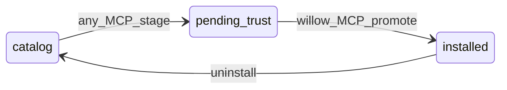

# ADR-20260615 — SAFE app install and trust promotion

**b17:** SITR1 · ΔΣ=42  
**Status:** Accepted  
**Date:** 2026-06-15

## Decision

SAFE app installs use a two-phase model: any MCP may stage files and record local `pending_trust` metadata, but only Willow MCP may promote to `installed` by writing `sap.installed_apps` and clearing PGP trust after verify/sign.

## Context

The Grove synthesis maps SCDS1 (store console UX) and SAPS1 (Postgres app registry) onto a single operator/installer surface in Grove. Three layers must stay aligned for a full install:

1. **Filesystem** — app artifact at `~/SAFE/Applications/<app_id>/`
2. **Runtime registry** — `sap.installed_apps` row (permissions, manifest hash)
3. **Trust** — PGP/GPG manifest signature verified against Sean's trust anchor (KB `871A1804`)

Early SAFE models treated folder existence as consent. SAPS1 and SCDS1 treat Postgres as runtime source of truth for gate checks. The installer must also work on non-Willow MCP sessions (portable install) without granting gate permissions prematurely.

Current `app_install` in `willow-2.0/sap/sap_mcp.py` copies files and registers a manifest under SAFE_ROOT but does not yet write `sap.installed_apps` or manage an explicit trust state. This ADR names the **target contract** before implementation.

## Install states

| State | Filesystem | Local metadata | `sap.installed_apps` | PGP trust |
|-------|------------|----------------|----------------------|-----------|
| **catalog** | absent | absent | absent | n/a |
| **pending_trust** | `~/SAFE/Applications/<id>/` staged | sidecar: `trust_status`, `manifest_hash`, `staged_at`, `staged_by_mcp` | **absent** | not verified |
| **installed** | present | cleared or mirrored to registry | **present** (`sap.register`) | verified/signed (host GPG per KB `E688E0BD`) |

### Non-Willow MCP — stage (`pending_trust`)

When the installer runs without Willow MCP authority:

1. Copy app artifact to `~/SAFE/Applications/<app_id>/` (or retain monorepo pointer — same semantics as today's `app_install` code path).
2. Write **local** metadata only at `~/SAFE/Applications/<app_id>/.install-state.json` with at minimum: `app_id`, `trust_status` (`pending_trust`), `manifest_hash`, `staged_at`, `staged_by_mcp`.
3. **Do not** insert into `sap.installed_apps`.
4. **Do not** grant gate permissions — SAP gate treats the app as not installed.
5. Emit a Grove event when available: `install_staged` with `pending_trust`.

### Willow MCP — promote (`installed`)

When Willow MCP becomes available (session start, MCP reconnect, or install-completion hook):

1. Scan for `pending_trust` records (filesystem sidecar; SOIL `installs` collection may mirror later).
2. For each pending app: verify manifest against the GPG trust anchor; sign or update if policy requires (**host-side GPG** — not Kart/bwrap per KB `E688E0BD`).
3. On success: call `sap.register(app_id, permissions, manifest_hash)`; flip or remove sidecar to `installed`.
4. On failure: remain `pending_trust`; surface reason in Grove installer pane or bus.

No manual promote step unless verify/sign needs human key unlock — auto-retry on next Willow MCP connect.

### Uninstall

Reverse every layer that exists for the current state:

- **`pending_trust`:** remove app folder and `.install-state.json` sidecar only.
- **`installed`:** remove folder, delete `sap.installed_apps` row (cascade `app_connections`), revoke or update PGP trust record per SAP policy.

## Alternatives considered

| Alternative | Why rejected |
|-------------|--------------|
| `sap.installed_apps` row with `trust_status=pending_trust` | Partial installs become visible to SAP gate before trust is real |
| Manual promote only | Operator friction; auto-promote on Willow connect is preferred |
| Folder-only consent without metadata | No machine-readable pending state for promotion scanner |
| Full install on any MCP without Willow | Bypasses PGP trust anchor and SAP authority path |

## Consequences

- Grove installer pane must distinguish **pending** vs **installed**; SCDS1 gate panels stay read-only until promotion.
- `app_install` and future Grove installer flows must branch on MCP identity (Willow vs other).
- Promotion scanner and `sap.register` integration in `willow-2.0` are follow-on implementation — not part of this ADR.
- Optional: short cross-reference paragraph in `safe-app-store-public/docs/specs/app_registry_spec.md` (SAPS1).

## Receipts

| Receipt | Ref |
|---------|-----|
| Integration brief | `git:` `docs/synthesis/store-console-source-map.md` (b17: SCMAP) |
| Cross-repo bridge | `git:` `docs/CROSS_REPO_BRIDGE.md` (b17: XRB01) |
| Store console spec | `git:` `safe-app-store-public/docs/specs/store_console_design_spec.md` @ `f13bcef` (b17: SCDS1) |
| App registry spec | `git:` `safe-app-store-public/docs/specs/app_registry_spec.md` (b17: SAPS1) |
| KB atoms | `871A1804` (catalog vs installed, GPG trust anchor), `E688E0BD` (GPG must not run in Kart/bwrap) |
| USER ratification | 2026-06-15 — folder + local metadata only on non-Willow MCP; auto-promote on Willow connect |
