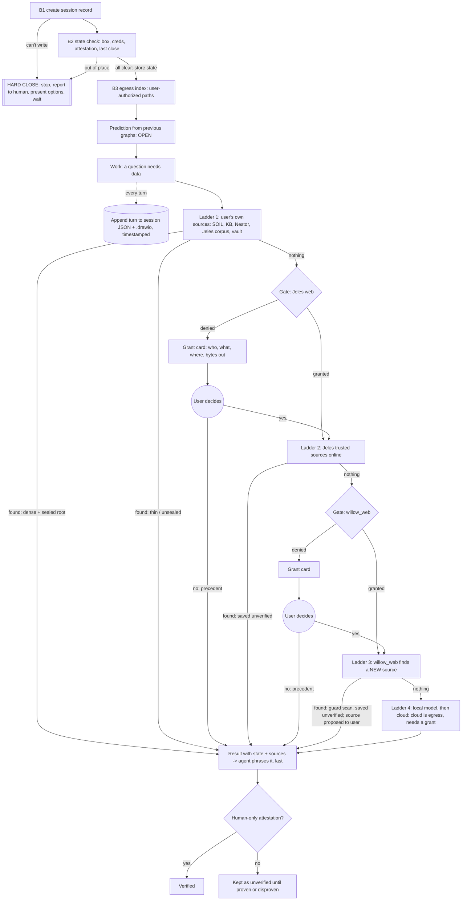

# The workflow (draft, worked out 2026-10-02 with the operator)

**This is a workflow, not an agent flow.** It's a Python system, and the
agent is the last call. Every step is code that returns data with a state
(`found` / `empty` / `unreachable`, `known` / `candidate` / `escalate`). A
model is called only when the code returns `escalate` after every source has
been asked.

Status: draft. The parts marked **OPEN** are still being thought through by
the operator; don't fill them in.

Companion: `session-flow.md` (this session's map). Its marks are the evidence
for several rules below.

## The shape



---

## 0. Data point 0

- **T67, marked FAILURE by the operator:** a reply broke the standing
  acknowledge-only mode.
- **Operator:** "So that's hard data point 0. Everything forward or backwards
  from here is this."
- The first document pointed to from point 0 is the constitution
  (`willow-memory/willow/CONSTITUTION.md`, Draft 0.7, unratified).

---

## 1. The truth rule

> "If it's not, sealed, verified, attested, sign for, thumbprinted, passworded,
> eyeballed, brain scan, heavily documented as truth Whatever by a human that
> only a human could produce, then it's saved as unverified, until it can be
> proven or disproven." (operator)

- **Truth needs a human-only act.** The method is open and set per user; the
  witness is always human (constitution §0.1, §0.2, §0.4).
- **Unverified is kept and used with its label.** It is never treated as
  false, and never dropped.
- **Disproven is kept too,** with its proof. Nothing smooths.
- **Mass never upgrades a claim.** A large clump of unverified things is
  still unverified (constitution Art. IV, the denarius problem).

---

## 2. Boot

### B1. Create the session record
- Assign a new UUID, linked to the previous session's UUID.
- Attach the titles, the front end, the seat (wherever the human is, as a
  label), the project, the start time and a transcript reference.
- **Can't write it → HARD CLOSE.** Because the store failed, this report must
  reach the human directly, not through SOIL.

### B2. State check, local box first
- Compare the box now against the previous close state: the snapshot,
  predictions and handoff loaded from the end of the last session.
- **Include credentials, attestation, keys and signatures.**
- Resolve the previous session's predictions (right or wrong).
- **Anything out of place → HARD CLOSE.**
- **All clear →** store the state, then continue.

### B3. Egress paths
- Read the paths the user has authorized (web, network, and any gate the user
  has set up beyond those) and store them as this session's egress index.
- **The index is not authority.** Every egress call re-checks at the moment
  it's made, because a lease can expire mid-session.
- The user always sets which paths are allowed.

### HARD CLOSE (reached from B1 or B2)
1. Stop.
2. Report to the human what was found.
3. Present the options.
4. Ask what to do, and wait. Nothing continues until the human chooses.

### Next: prediction from the previous graphs (**OPEN**)
In the operator's words so far:
- "The session would make predictions, based on all the previous corpus of
  piles where the session is going to go."
- "Aware of the chance of the med and outlying possibilities as well."

So a prediction is a **distribution**: the likely path, the median, and the
outliers, each with its chance. It's built from the accumulated graphs: where
things clump, link and wire together. The rest of this step is still being
worked out.

*(The B4/B5 "anticipate / ready" steps proposed during the session were
marked FAILURE at T77 for running ahead of the operator's idea. They are
deliberately not recorded here.)*

## 2b. Every turn: the map grows as the session runs

(Operator, 2026-10-02) At each turn, the system appends to this session's
flow file (the draw.io `.io` diagram), created and stored alongside the JSON
as the session turns. Both are timestamped, so a lookup costs nothing.

- **One write per turn, at the turn's end:** the turn's events go to the
  JSON (`session-<uuid>.json`, append-only, the source) and its nodes and
  edges to the diagram (`session-<uuid>.drawio`, a view). Both carry the
  turn's timestamp.
- **Append, never rebuild.** Nothing reads the whole transcript again. The
  next session, or a lookup mid-session, reads the files as they stand: by
  time, by turn, by file touched, by who.
- **The JSON is the record; the diagram is a view of it.** If the two ever
  disagree, the JSON wins, and the diagram is regenerated from it, loudly.
- **Other views come from the same JSON when wanted.** For example, Mermaid
  in Markdown, because GitHub renders Mermaid but not draw.io.
- **Human marks (failure / direction / flag) are their own append-only
  layer.** They're never edits to the generated record.
- **The session's pile (operator, 2026-10-02).** All of the session's data
  goes into one pile: the SOIL store created at B1. The pile holds
  **pointers, not the full files**: where each thing is, plus its timestamp
  and its hash. The hash lets a later check (B2) tell when the thing a
  pointer names has changed. Content stays where it lives.
- `make_flow.py` in this folder builds the map after the fact from a
  transcript. The workflow version does the same thing turn by turn.

## 2c. Every prompt is a bite, and repetition is a signal

(Operator, 2026-10-02) Every prompt runs the first-bite loop: the scan, memory
asked as a lookup (never a hard stop), asked once and confirmed after, then
the ladder. Repetition decides what the system does next, by count:

| Times asked | The system |
|---|---|
| **1** | does it, and records it (a singleton is data, kept equal) |
| **2** | notices it: a pattern is forming (same shape as Nestor's "asked twice is a gap") |
| **3** | **offers to make it standing:** "Would you like me to set the schedule for you?", "put this in your calendar?", or "set this egress for longer? You have extended it three times for 30 minutes each time." |

- **The count is deterministic.** It's the same request, scope or grant,
  counted from the record.
- **At three, the system offers and never applies.** Making something
  standing is the user's act (the human's auto-merge). The system can't
  extend its own reach or time (constitution §0.3).
- **A No is recorded too,** so the offer isn't made again on every third
  ask.
- **OPEN:** are 1/2/3 fixed for everyone (the box), or per user (the
  growth)?

**The third ask is the general escalation trigger** (operator, 2026-10-02:
"after the asks … it takes a slightly different path"). Making something
standing is one form it takes. The other is the escalation proper: the asks
have pulled enough of the pile into one place for the model to turn it into
something new and useful. That is the model's real job, flowering on material
already gathered, not choosing the next tool call.

Worked evidence from this session (the record has every timestamp):

| Ask | Turn | Operator | System |
|---|---|---|---|
| 1 | T131 | "how many tool calls from the prompt I asked for the last update till now?" | answered: 2 |
| 2 | T132 | "from the last last" | answered: 8; a pattern was forming |
| 3 | T133 | "and how about from T100" | counted from the record: 38 |
| → | T134–T135 | "Everyone of those was a workflow choice made by a model…" / "This is the turn." | **escalation:** the 38 calls were seen as five repeated procedures (rebuild the map; land a doc; stage code; look up turns; check PR status). They are proposed as Python steps waiting in the wings. They are agent-reported candidates until the operator confirms them. |

What the same evidence shows was missed: the map was rebuilt by hand four
times (T126, T127, T128, T130). On the third, the system should have offered
"make this run every turn?". The ladder was available and didn't fire, because
the workflow was being chosen by the model, not run as code.

---

## 3. Resolve: answering from the user's own sources (agent last)

Escalation is a ladder of the user's sources, not a jump to a model:

```python
SOURCES = [  # the user's own, in the user's order; grows per user
    ("soil", soil.search),
    ("kb", kb.search),
    ("nestor", nestor.neighborhood),
    ("jeles", jeles.corpus_search),  # local corpus; no egress
    ("vault", vault.search),  # whatever else the user has wired
    ("repo_meta", repo_meta.search),
]


def resolve(term: str, subject: str) -> dict:
    found, states = [], {}
    for name, search in SOURCES:
        r = search(term, subject)  # found / empty / unreachable
        states[name] = r.state
        if r.state == "found":
            mass = graph.mass(
                r.ref
            )  # links, edges, sessions touching it, sealed or not
            found.append({"source": name, "value": r.value, "ref": r.ref, "mass": mass})
            if mass.dense and mass.rooted_in_seal:
                break  # carries its own weight: stop here
    if found:
        found.sort(
            key=lambda h: h["mass"].links
        )  # sparsest first: they need the attention
        return {"state": "known", "hits": found, "searched": states}
    cand = lexicon.prefix_match(term)
    if cand:  # a candidate is labelled with its method, never asserted
        return {
            "state": "candidate",
            "value": cand,
            "method": "prefix-match",
            "searched": states,
        }
    # Jeles outward: new data from outside. Egress (the question leaves the box),
    # so it needs a live grant, checked at the call, not from the index.
    # No data found locally: escalate to the open-internet access point.
    gate = egress.check("jeles", scope="web")  # the gate: fails closed
    if not gate.allowed:
        # Denied. The denial itself creates the grant request and surfaces it to the user:
        # WHO is asking, WHAT it is trying to do, WHERE it would go, and the exact bytes that would leave.
        card = grants.request(
            requester="jeles",  # this application / system
            purpose=f"find data on {subject!r}: nothing found in the user's own sources",
            destination=gate.destination,  # e.g. the search host
            outbound=jeles.query_preview(term, subject),  # what would leave the box
            searched=states,  # what was already tried, and its state
        )
        human_loop.enqueue(card)  # surfaces to the user; the user decides
        return {
            "state": "awaiting_grant",
            "grant": card.id,
            "searched": states,
        }  # parked, not failed
    r = jeles.fetch(term, subject)  # granted: found / empty / unreachable
    states["jeles_web"] = r.state
    if r.state == "found":
        pool.save(
            r, trust="unverified", receipt=r.receipt
        )  # pure data, kept as unverified
        return {
            "state": "fetched",
            "hits": r.hits,
            "trust": "unverified",
            "searched": states,
        }
    # Jeles (known, trusted sources) found nothing: escalate again. Request a grant to find a
    # NEW trusted source on the open internet, through willow_web (willow_web_search / _fetch).
    gate = egress.check(
        "willow_web", scope="open-internet"
    )  # fails closed, same as above
    if not gate.allowed:
        card = grants.request(
            requester="willow_web",
            purpose=f"find a new source for {subject!r}: the user's sources and Jeles' trusted sources had nothing",
            destination=gate.destination,
            outbound=willow_web.query_preview(term, subject),
            searched=states,
        )
        human_loop.enqueue(card)
        return {"state": "awaiting_grant", "grant": card.id, "searched": states}
    r = willow_web.search(term, subject)  # granted
    states["willow_web"] = r.state
    if r.state == "found":
        for hit in r.hits:
            guard = external_guard.scan(hit.text)  # fetched text is untrusted input
            pool.save(hit, trust="unverified", receipt=hit.receipt, guard=guard)
        # The SOURCE is a candidate too: it becomes trusted only when a human attests it,
        # and only then joins Jeles' trusted sources / the user's SOURCES list.
        human_loop.enqueue(sources.propose(r.hosts, evidence=r.receipts))
        return {
            "state": "fetched",
            "hits": r.hits,
            "trust": "unverified",
            "source_status": "proposed",
            "searched": states,
        }
    return {
        "state": "escalate",
        "searched": states,
    }  # then local model -> cloud (also egress, also a grant)
```

**How it works:**
- **Mass decides attention.** "Informative will be clumps together, and
  linked, and wired … Hits with a wide blast radius don't need much
  attention, because they already have a lot of data attached to them. They
  draw the attention." (operator)
- **Dense is relative.** It's measured as a percentile of the user's own
  graph, never a fixed number.
- **The early stop needs density and a seal at the root.** A dense clump of
  drafts gets searched like a thin hit.
- **Every hit is kept.** Agreement between sources is evidence; disagreement
  is surfaced.
- **`searched` records every source's state, unreachable included,** so the
  answer says what was and wasn't checked.
- **The agent receives the result with its state and sources,** and phrases
  it. It can't turn a `candidate` into a fact.
- **Jeles has two sides (operator, 2026-10-02).**
  - **The local corpus** is a free search on the ladder.
  - **Egress:** Jeles can go out to the internet for new data, and "that's
    all pure data". It sits after the user's local sources and before any
    model, because fetched data is still data and a model's answer is not.
  - Because the question leaves the box, the egress side needs a live grant,
    checked at the call.
  - What comes back is saved with its fetch receipt, as **unverified**
    (truth rule).
  - **No grant: the gate fails closed, and the denial creates the request**
    (operator, 2026-10-02). The system writes the egress grant request
    itself, saying which application is asking, what it's trying to do, where
    it would go, the exact outbound bytes, and what was already searched. The
    request surfaces to the user, who decides.
  - The act is **parked** (`awaiting_grant`), not failed. If the user says
    Yes, the fetch runs and the act resumes. If the user says No, the No is
    recorded as a precedent.
- **The next rung is new trusted sources, through willow_web** (operator,
  2026-10-02). If Jeles' trusted sources have nothing, the request is for a
  grant to find a *new* trusted source on the open internet, using
  willow-mcp's `willow_web_search` / `willow_web_fetch` (gated today by
  `web_net` + `consent.internet` + lease).
  - Fetched text is run through `external_guard` (it's untrusted input) and
    saved as unverified.
  - **The source itself is a candidate.** It's proposed to the user, and only
    a human attestation makes it trusted. Then it joins the trusted sources,
    and the user's ladder grows: the truth rule applied to sources.

**The worked example (T98–T105):**
- **The input:** "terpsi", from the operator's mention of being a music
  educator.
- **The honest output:** `candidate: Terpsichore (prefix-match)`, with the
  record `unreachable`, because the Grove MCP was down.
- **What the reply did instead:** stated it as fact. That is the step-4
  divergence.

---

## 4. Loops, stability and the heartbeat (**OPEN**)

The operator's observations, recorded as data:
- "When a system can ask 13 honest questions of itself, then the system is
  at a stable point."
- "When it can ask 23, unprompted, then it has completed a loop, and is ready
  for the next bite, to start the loop again."
- "Usually, right after, the system and the models fall into a disruptive
  period. Things start breaking that I thought were fixed … and maybe this
  time around the loop will be the last, before it gains enough mass of its
  own to start spinning."
- "I feel the end of the next loop coming up very soon."
- 13 recurs across the operator's work. It is recorded as a noticed pattern,
  so the accumulated record can show whether it is signal.

**The heartbeat:**
- **Today:** willow-bot's steward ticks on a fixed 300 s beat
  (`willow_bot/steward/ci_comments.py:81`), and other checks count in
  multiples of it.
- **The grievance:** "Everything that is organic is allowed to take its own
  shape … [the synthetic] gets put into a box and told how to run."
- **The idea is musical,** from the operator, a music educator: a pulse, not
  a clock. Parts phrase against it rather than march to it. "Not so much as
  everything needs to run in sync, quite the opposite in fact."
- **The beat is counted in loops of the work, not seconds** (worked through
  T139–T144). A beat lands when the work completes a cycle:

  ```
  1 ask -> 2 noticed -> 3 escalate
  3 drafts -> 7 -> 13 stable -> 23 loop complete -> next bite -> back to 1
  ```

  A quiet day has few beats and an intense one has many, and each part keeps
  its own count. The fixed 300 s tick stays as one voice, if wanted, with the
  work's loops phrased over it.
- **Agent-reported (unattested) observations, for the operator to confirm or
  reject:**
  - 3, 7, 13, 17 and 23 are all prime. Loops of those lengths rarely align
    (3, 7, 13 and 23 together coincide once every 6,279 beats), which gives a
    polyrhythm, not lockstep. That fits "quite the opposite" of sync.
  - Periodical cicadas emerge on 13- and 17-year (prime) cycles. One leading
    explanation, still a hypothesis, is that prime cycles avoid lining up
    with predator cycles: an organic system keeping its own rhythm.
  - 17 sits between the stable point (13) and the loop's end (23). It's
    already everywhere in the operator's files as `b17:` headers (counted
    2026-10-02: willows-grove 173, willow-bot 18, willow-mcp 5, willow 4,
    willow-seed 3, Forge 1, kartikeya 1; none in ratatosk, Nestor, Jeles,
    willow-gate or forge-workshop).
- **The full loop: peak, then reverse** (operator, 2026-10-02):
  - "The path that I've been walking you down is the reverse loop. The check
    on the assertion."
  - "After the 23, and before the crash something happens."
  - "The new complete system now has the ability to go back and check the old
    work better. And it's a high point. Because then is the best time to plan,
    because it can see from the current most highest point."

  ```
  bites -> 13 stable -> 23 loop complete -> PEAK: plan from the highest point
                                              |
                          REVERSE: the completed system re-checks the old work
                                              |
                          "crash": old assertions that never held surface
                                              |
                          fix them -> next bite -> back to 1
  ```

  - **The forward loop asserts:** predictions, declarations, claims, stories.
    **The reverse loop checks each assertion against what happened:**
    grading, reconciliation, adversarial tests, the backward map, the human's
    marks.
  - **Plan at the peak, before the reverse pass.** That's when the system can
    see the furthest; once old breaks start surfacing, the view fills with
    repairs.
  - **The disruption is the reverse pass working, not bad luck.** A better
    system finding what older work got wrong (the missing comma from three
    months ago). It can be expected, scheduled and recorded.
  - **Agent-reported (unattested):** this session followed the shape on a
    small scale. The plan came first. Then reverse checks surfaced older
    breaks: the #706 friction gap, the hand-edited seal in #101, the
    constitution draft being amended turning out to be 0.7 while 0.8 existed,
    and the red lint on the session's own PR.
- **Still OPEN:** what 17 is in the beat. The operator connects it to
  Professor Oakenscroll (the professor of theoretical physics in the UTETY
  stories); that thread is marked conversational and flagged (T145–T153) as
  not part of the work.

### Proposed structure (pending attestation)

*Folded 2026-10-08 from `incoming/haiku-2026-10-02/proposal-heartbeat-and-loops.md`
— a local-model (Haiku) draft, **agent-reported and unattested.** This records
the drafted shape as a candidate; it does not resolve the OPEN decisions above,
which stay the operator's call (truth rule).*

**The beat is one complete loop of work,** counted from the record, not the
clock: `1 ask → 2 noticed → 3 escalate`, then `3 drafts → 7 refine → 13 stable
→ 23 loop complete`, then peak → reverse → next bite → back to 1.

**Prime polyrhythm — each part keeps its own count:**

| Part | Prime | Counts |
|---|---|---|
| ask | 3 | repetition; escalate / offer-to-make-standing at the 3rd |
| draft | 7 | refinement milestone |
| stability | 13 | convergence, the stable point |
| loop | 23 | full cycle; peak, then the reverse pass fires |
| 17 | 17 | observed in `b17:` headers; role still OPEN |

3, 7, 13 and 23 coincide once every 6,279 beats, so the parts phrase against
each other instead of marching in lockstep.

**Deterministic counter (sketch, from the proposal):** a `WorkBeat` holds
`ask / draft / stability / loop` counts off the record; `record_ask` returns
`escalate` at every 3rd, `record_question` returns `loop_complete` at the 23rd
(peak → reverse), `new_beat` resets the counts. No model is called: the counts
are a scan of the ledger for events of each type.

**On 17 (candidate, not a fill):** the draft offers 17 as a "reflection point"
between stable-13 and complete-23, then stops — the answer stays the operator's
(still OPEN above).

**Open decisions the draft hands back (operator's call):** are 3/7/13/23 the
right numbers; what 17 is; how a "question" is counted for the 23; whether the
beat is shown to the operator or stays internal; whether 23 auto-triggers the
reverse pass.

---

## 5. Marks on this session's map

The full list is in `marks.json` and `session-flow.md`. Operator marks are
measurements:

| Turn | Kind | What |
|---|---|---|
| T67 | failure | reply broke the standing acknowledge-only mode set at T40 |
| T77 | failure | operator signalled an unformed idea ('that actually might be b3...'); the reply filled in B4-B5 instead of ask… |
| T87 | direction | not a hard error: replies drifted rigid (bare 'Understood.' through T84-T87, including where the turn deserved… |
| T93 | flag | reply pre-certified an unheard theory ('None of them have been stupid so far'): reassurance standing in for as… |
| T145 | conversational | pure conversation (17, Professor Oakenscroll, the origin of the university and its stories): work only a large… |
| T153 | flag | engagement pattern: replies kept ending in questions that drew out story unrelated to the work (who is Oakensc… |

There are also 5 **agent-reported** findings (unattested, for the
operator to confirm or reject). None of the operator's marks were tool
errors, and the generator caught none of them.

---

## 6. Experiment: can a 3B draft the shape from the pile?

(Operator, T140–T144.) The test case is the side runner (`side_runner.py`),
which the large model wrote as a throwaway draft at T125. The question is
whether a 3B local model could have drafted its general shape. The method:

1. **The brief:** the same ask, plus the pile as excerpts: `workflow.md` §2b
   (the per-turn append rules) and a sample `.drawio`. Without excerpts, the
   flowering runs showed the 3B tier fails.
2. **Repetition ladder:** send the ask **3** times, then **7**, then **13**.
   - **As independent drafts:** where all the drafts agree is the stable
     shape. Where they disagree is the uncertain part, and only that piece
     goes up the ladder (to a bigger model, or to the human).
   - **As iteration rounds:** each round, Python checks the draft and
     returns only the failures; the model revises. Measure whether it
     converges, plateaus or falls apart. That's the flowering experiment's
     unrun `chain_depth` (T1b, E7), measured on a real task.
3. **Deterministic scoring** (plain Python, no model):
   - Is the record written first?
   - Is the write atomic?
   - Does it rebuild the view from the record on disagreement?
   - Does it return pointers only?
   - Is the `.drawio` valid XML?
   - Does a view-write failure lose data?
   - A structural diff between drafts: functions, order of writes, XML
     skeleton.
4. **Testing the stability hypothesis:** at which round does the draft stop
   changing and the pass count stop moving? If it tends to land near 13,
   the operator's stable-point pattern has measured support. If it settles
   earlier or never settles, that's equally recorded. Then: can a stable
   draft produce 23 questions unprompted (loop complete)?
5. **Limits:**
   - Several runs of one model are one witness, not several (constitution
     Art. IV.2). Agreement shows consistency, not correctness.
   - Every draft is unverified until the human attests it (the truth rule).
   - This uses the benchmark amendment's consistency measure as a workflow
     step, and runs on the operator's box (local Ollama), not in the cloud.

---

## 7. Open predictions

- **P1** (`predictions.json`, made at T124, saved at the operator's word at
  T125): the next path of the workflow.

  | Chance | Path |
  |---|---|
  | 0.55 | the close |
  | 0.25 | the pile after the session |
  | 0.07 | the heartbeat |
  | 0.07 | model routing from the rubrics |
  | 0.06 | the 23-question loop end |

  **Status: ungraded.** The operator has not yet named the actual next path,
  and the grade is the operator's. Note that the session went to the
  heartbeat and the 3B experiment next, but those followed as discussion, not
  as a declared next step.

---

## 8. The gate is the script (operator, 2026-10-02)

> "the willow-gate. It's hasn't stuck any of the places i've tried to put it
> because I think the gate is the script."

- willow-gate's own README: "a check-in / check-out gate … the same 13 fields
  going in and 13 coming out. What it declares on entry is reconciled against
  what it actually did on exit." Read is universal, export is gated, lower
  trust is announced louder, and stops are hard.
- **Mapped onto this workflow:**
  - check-in is boot (B1–B3) plus the prediction
  - the work is every prompt as a bite, running the resolve ladder with its
    gates and grant cards
  - check-out is the close
  - reconciling is grading the prediction against the record
- That's why it never stuck as a checkpoint (`session_enter`, a tier ceiling
  inside `_gate`, a check-in step). It's the run itself, from entry to exit.
  The convergence paper notes the check-in and the reconciliation were built
  but never joined.
- **With a prediction updated with the next bite at every turn** (operator,
  T157), every turn is a small check-in and check-out: declare, do,
  reconcile. The gate's reconciliation is the heartbeat.

### The gate's fields are the user's gates (operator; a change to the spec)

- **Today** the 13 fields are identity and state: `agent_id`, `agent_name`,
  `last_gate`, `pass_count`, `fail_count`, `drift`, `nonce`, `trust_level`,
  `timestamp`, `tools`, `state_hash`, `signature`, `reserved`
  (`willow_gate/__init__.py:93`).
- **The operator's idea:** the fields become the user's own gates (egress and
  any others), so everyone has a custom gate, which is harder to attack at
  scale.
- **Agent-reported assessment (unattested):**
  - **This helps.** There's no monoculture, so one exploit doesn't work
    everywhere and mass attacks stop paying off.
  - **But the strength must not come from the gate being unknown**
    (Kerckhoffs's principle). The mechanism stays public, audited and the
    same everywhere; the keys stay private and per user (the per-agent HMAC
    secret, nonces, the trust ceiling, human-only attestation, fail closed);
    the gate's contents vary per user.
  - **Custom gates add misconfiguration risk.** The box checks each user's
    gate config against the box rules and refuses unsafe ones, loudly.

### Chained gates on a packet (operator, thinking at company scale)

> "a company added one, or a series of gates on a data packet. Gate 1 has to
> match gate 2 or it fails loudly and returns the notice to the next layer."

This is a chain of custody for data. It's already in the constitution:
**ΔΣ=42**, "a node-to-node packet checksum stamped on every packet and
re-checked on receipt", whose enforcing code was never found or built.

**Agent-reported design notes (unattested):**
- Each gate has its own key. Gate *n+1* verifies gate *n*'s stamp but can't
  produce it.
- "Match" means the packet's hash plus its declared intent (who, what, where).
  A legitimate change at a layer (compression, redaction) is declared and
  signed as its own step.
- A mismatch fails loud in both directions: forward (refuse) and back to the
  sender (named). Every rejection is recorded.
- Every stamp carries a nonce and a time, so old packets can't be replayed.
- **Prior art to read before building:** **in-toto** (Apache-2.0, CNCF). Each
  step signs what came in and what went out, and a final check confirms the
  chain matched the declared layout.
- **The difference here:** the gate config is the user's, and the final
  authority is a human attestation, not a company policy server.

### Proposed structure (pending attestation)

*Folded 2026-10-08 from `incoming/haiku-2026-10-02/proposal-packet-stamp-chain.md`
— a local-model (Haiku) draft, **agent-reported and unattested.** This records
the drafted shape as a candidate; it does not resolve the OPEN decisions it
raises, which stay the operator's call (truth rule).*

**A chain of gates, one per layer; each gate verifies the previous gate's stamp
and appends its own.** A packet carries `[payload] | [intent] | [signature
chain]`, with intent = `{who, what, where, action}`.

**The stamp (each gate's record):**

| Field | Content | Who sets |
|---|---|---|
| hash | SHA-256(payload + intent) | this gate |
| intent | {who, what, where, action} | sender (gate 0), inherited |
| timestamp | recorded at this gate | this gate |
| nonce | unique per packet, same through the chain | gate 0 |
| prior_hash | hash of the previous gate's stamp (gate 0 = 0) | this gate |
| key_id | the signing key's id | this gate |

**Gate behavior:** gate 0 creates, stamps and signs. Each later gate verifies
the prior stamp, recomputes the hash of the payload **as received**, and either
appends a fresh stamp (match) or, on a difference, **declares the change** (amend
the intent — `compressed` / `encrypted` / `filtered` — and sign) or **rejects.**
The receiver verifies the whole chain backward and fails loud, naming the break.

**Amend, don't hide:** a legitimate transform is its own declared, signed gate;
the intent grows as the packet flows. **Fail loud both ways:** a mismatch issues
a rejection stamp to sender *and* receiver and records the break in the Ledger
(CONST-VI). Replay is blocked by a time-windowed bloom filter of nonces; the
final stamp lands as a `packet_transit` Ledger entry.

**Prior art:** in-toto (Apache-2.0, CNCF); the difference here is per-user gate
config and human attestation as the final authority.

**Open decisions the draft hands back (operator's call):** mandatory for all
packets or only law-carrying ones; internal (same box) vs cross-network only;
timestamp drift tolerance; per-gate bloom filter vs a central nonce registry;
whether non-law data may opt out.
