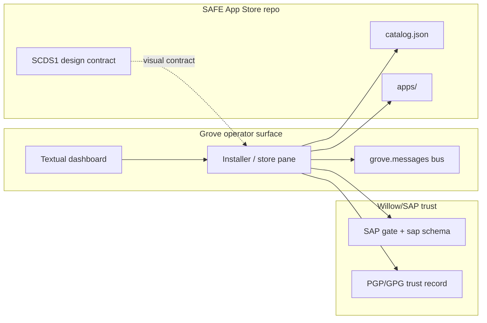

# Store Console Source Map

**b17:** SCMAP · ΔΣ=42  
**Date:** 2026-06-15  
**Status:** Integration brief (mapping only — no implementation)  
**Author:** willow (Hanuman)

## Purpose

Map how the merged **SAFE App Store Console & Skin Design System** (SCDS1) fits the existing Grove synthesis, SAFE App Store vision, and SAP consent model. This document names overlaps, gaps, and the next edits — it does not implement the console.

---

## Source inventory

| Source | ID / path | Trust | Contributes |
|--------|-----------|-------|-------------|
| Store console spec | SCDS1 · `safe-app-store-public/docs/specs/store_console_design_spec.md` | **Canonical** (merged `f13bcef`, 2026-06-15) | Control-panel UX, Era Skins, manifest→gate mapping, SAP write flows |
| App registry spec | SAPS1 · `safe-app-store-public/docs/specs/app_registry_spec.md` | Draft backend sibling | `sap.installed_apps`, `sap.app_connections`, install/cross-app flows |
| Vision & gaps | `safe-app-store-public/docs/app_store_vision_and_gaps.md` | Working draft (2026-06-08) | E1–E10 gap list; sovereign-first thesis |
| Grove cross-repo bridge | `safe-app-willow-grove/docs/CROSS_REPO_BRIDGE.md` | Canonical | Grove = comms + UI surface; Willow = KB/tasks/routing |
| Grove skins (TUI) | `safe-app-willow-grove/docs/superpowers/specs/2026-04-24-grove-skins-beauty.md` | Design ready | Terminal beauty pass — separate surface from web Era Skins |
| Full stack synthesis | `sean-data-vault/professional/frameworks/full-stack-synthesis.md` | Active (2026-03-29) | Folder-at-`SAFE/Applications/` = consent; SAP library; OpenClaw outward wall |
| KB atom | `871A1804` | Frontier | Catalog vs installed paths; Grove as user-triggered install channel |
| Alignment synthesis | `willow-2.0/sandbox/stone_soup/reports/alignment-synthesis.md` | Final (2026-06-14) | Cross-project invariants (Rendereason / angrybob / Willow); unrelated to store UX but same "honest gap" spine |

---

## Shared invariants (all sources agree)

1. **Portless / local-first** — no exposed web ports for the sovereign stack; store console is static web under the app repo, not a listening server.
2. **Manifest-driven** — `safe-app-manifest.json` is the contract; permissions and `data_streams` are explicit.
3. **User is gatekeeper** — install, toggle, cross-app grant, uninstall are user-initiated; apps degrade when denied.
4. **SAP-gated writes** — consent decisions round-trip through the SAP gate; never direct Postgres edits from UI.
5. **Proof over promise** — privacy meter (`local_processing`), nutrition label (`data_streams`), locked gates show what was *not* requested.
6. **Signed trust chain** — installed apps must remain tied to Sean's GPG/PGP trust anchor. An install path that writes folders and Postgres but does not update the signed trust record is incomplete.

---

## What SCDS1 adds (locked decisions)

| Decision | Implication |
|----------|-------------|
| Control panel, not storefront | Emotional register = *in command*; browse/install is permission management, not shopping |
| Era Skins | Inherit `the-squirrel/skins/` CSS contract; promote to shared `design/` layer |
| Status tokens | Extend contract: grant / deny / warn / danger / meter — per-era dialect ("green breaks in 80s") |
| Manifest → gate panel | Eight gate groups (network, MCP, KB, store, filesystem, LLM, cross-app, background) |
| GUI = SAPS1 terminal | Install / toggle / cross-app / uninstall are two faces of the same SAP write |
| Planned surface | `apps/safe-app-store/web/` + `store.css`; shared `design/skins/*.css` |

### SCDS1 still open (needs USER sign-off)

- Shared `design/` at repo root vs per-app copy
- Skin persistence: `localStorage` vs registry sync (recommend localStorage first)
- Default skin: **mcm** recommended
- Locked-gate visibility: show full threat surface greyed vs requested-only

---

## Gap overlap map

| Vision gap | SCDS1 response | Still open after SCDS1 |
|------------|----------------|------------------------|
| **E2** No store UX | **Designed** — app rows, gates, meters, install/uninstall UI | **Not built**; no code in repo yet |
| **E5** Consent unenforced | Gate panel + nutrition label + SAP writes | SAP gate + registry must exist and be wired |
| **E8** UI fragmentation | Shared Era Skin contract + cascade prize | TUI apps (Grove, Textual suite) use different skin system |
| **E1** No install/distribution | Partial — install *UI* designed | Distribution story (non-developer path) untouched |
| **E3** Integrations narrative-only | Cross-app grant rows → `sap.app_connections` | Pipeline code between apps still zero |
| **E9** Broken entry points | Uniform launch not in SCDS1 scope | Manifest cleanup still required |

---

## One operator place, three render surfaces

| Surface | Repo | Skin system | Primary job |
|---------|------|-------------|-------------|
| **Grove operator place** | `safe-app-willow-grove` | TUI skins now; can echo Era names later | Fleet comms plus direct install/discovery surface |
| **Store apps/catalog** | `safe-app-store-public` | Era Skins design contract for web apps | Source of app manifests, app paths, design tokens |
| **SAP terminal/API** | `willow-2.0` / SAP | TOAS1 (CLI aesthetic) | The trust/write path: `[y/N]`, registry, PGP/GPG verification |

**Revised synthesis rule (USER ratified 2026-06-15):** Grove and the installer belong in the **same operator place**. The Grove app should point directly at store apps (`catalog.json` + `apps/<id>`), call the SAP/MCP install path, and emit Grove events. There should be **no middle-manager service** between Grove and the store catalog/apps. SCDS1 remains the design contract for what the permission/skin surface should feel like, but the install/discovery control should live where the operator already is: Grove.

---

## Tensions to resolve in the next synth pass

### 1. Folder consent vs Postgres registry — **resolved**

**ADR:** [`ADR-20260615-safe-app-install-trust.md`](../adrs/ADR-20260615-safe-app-install-trust.md) (b17: SITR1)

| Model | Source | Role |
|-------|--------|------|
| Folder artifact | full-stack-synthesis, KB `871A1804` | Staged at `~/SAFE/Applications/<app>/`; required for both `pending_trust` and `installed` |
| Postgres registry | SAPS1, SCDS1 | Runtime source of truth for gate checks — written only on Willow MCP promotion |
| PGP/GPG trust | KB `871A1804`, KB `E688E0BD` | Verified/signed on promotion; host-side GPG only |

**Locked model:** Two-phase install. Any MCP may stage files + local `.install-state.json` (`pending_trust`); no `sap.installed_apps` row until Willow MCP auto-promotes after PGP verify/sign. Full install = folder + registry + trust. Uninstall reverses all layers present for that state.

### 2. Grove as installer place

KB `871A1804` says Grove is the user-triggered install channel. With the revised direction, Grove is not just notifier/transport: it is the **installer place**. The installer pane should read the store catalog directly, point at store app folders directly, and invoke the SAP/MCP install path directly. The permission write still belongs to SAP, and the trust update still belongs to the PGP/GPG trust path, but no separate store-orchestrator service should sit between Grove and the apps.

### 3. Two skin systems

- Grove TUI: xterm indices, rounded borders, Discord layout (`grove-skins-beauty.md`)
- Store web: CSS `--color-*` Era Skins (`SCDS1`)

**Not a bug** — different render targets. **Cascade prize** (SCDS1 §8) applies to **web apps** sharing `design/`. Grove can **echo** era names (mcm / 80s / 20s) in TUI themes later; not required for v1.

### 4. Portless rule vs web console

SCDS1 plans static `apps/safe-app-store/web/index.html` — opened locally (file:// or `python -m http.server` for dev), not a persistent daemon. Aligns with SAFE portless ethos if we never ship a listening store server.

### 5. Standalone vs Willow-backed

Vision doc (A3): flagship apps must run **without Willow/Postgres**. SCDS1 assumes SAP Postgres tables. **Bridge:** console degrades to read-only catalog + folder check when `sap` schema unavailable; full gate panel requires Willow. Name this explicitly in implementation — do not silently require Postgres for browse-only.

---

## Alignment with stone_soup synthesis (tangential)

The alignment report (`alignment-synthesis.md`, score 0.955) validates cross-project invariants: canon under reduction, honest gap (ΔΣ). SCDS1's nutrition label and locked gates are the **UX expression** of the same epistemic rule — show what is known, mark what is not requested, warn on mixed tier. No conflict; optional cross-link in a future public architecture doc.

---

## Next synth targets (ordered)

1. **Cross-link in Grove INDEX** — add `docs/synthesis/` entry pointing here and to SCDS1 path in safe-app-store.
2. **Update `CROSS_REPO_BRIDGE.md`** — one paragraph: Grove is the operator/installer place; safe-app-store is the direct catalog/app source; no middle-manager service.
3. ~~**Resolve folder↔registry↔PGP rule**~~ — done: [`ADR-20260615-safe-app-install-trust.md`](../adrs/ADR-20260615-safe-app-install-trust.md) (SITR1).
4. **Vision doc annotation** — mark E2 as "SCDS1 drafted" in `app_store_vision_and_gaps.md` (safe-app-store-public).
5. **Implementation gate** — SCDS1 §11 defines the design contract; Grove work becomes installer/store pane + direct catalog/app pointers + bus events, while SAP keeps the write/trust authority.
6. **Starter borrow map** — [`grove-starter-borrow-map.md`](grove-starter-borrow-map.md) (GSBRW): steal vs wrap for starter-pack scouts vs existing Grove panes.

---

## Receipts

| Artifact | Location |
|----------|----------|
| SCDS1 spec | `safe-app-store-public/docs/specs/store_console_design_spec.md` @ `f13bcef` |
| SAPS1 backend | `safe-app-store-public/docs/specs/app_registry_spec.md` |
| This map | `safe-app-willow-grove/docs/synthesis/store-console-source-map.md` |

ΔΣ=42
