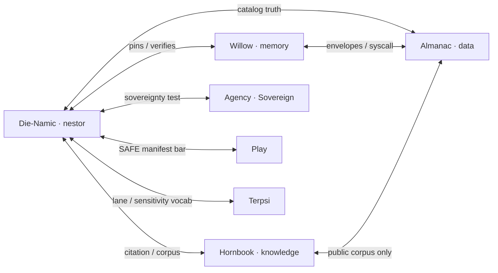

# Fleet placement draft — tiered cull

**Status:** draft · §11 + **Option 1** · §12 die scaling map · Sovereign/Play/Terpsi as draft faces — **not final**  
**Rule:** Only named org repos earn GitHub homes; the rest is playground, workshop, or cut.

**Sources:** §11 (your sort order) + charter `design/architecture/` (runtime/corpus).

---

## The four orgs (repo homes — matches §11)

| Org | URL | Repos on org (today’s placement) |
|-----|-----|----------------------------------|
| **Die-Namic-Systems** | [github.com/Die-Namic-Systems](https://github.com/Die-Namic-Systems) | `.github`, **`die-namic`** *(base seat, draft)*, **`nestor`** |
| **willow-memory** | [github.com/willow-memory](https://github.com/willow-memory) | `.github`, **`willow`** *(charter seat — target)*, **`willow-mcp`**, **`willow-gate`**, **`kartikeya`** |
| **hornbook-knowledge** | [github.com/hornbook-knowledge](https://github.com/hornbook-knowledge) | `.github`, **`hornbook`** *(base seat, draft)*, **Terpsi** *(interim)*, **`UTETY`**, **`Jeles`** · Squarespace |
| **almanac-data** | [github.com/almanac-data](https://github.com/almanac-data) | `.github`, **`almanac`** *(base/meta seat, draft)*, **`almanac-template`**, vertical almanacs (see §4) |

Personal account + SAFE playground hold everything else until **promote**, **transfer**, or **cut**.

### Org strategy (decided 2026-08-03)

**Option 1 — status quo:** keep **four thematic orgs** (table above). Add **Sovereign** and **Play** as **future die faces** (+ likely fifth/sixth orgs), not a merge into `willow-data` / `willow-knowledge` / unified `willow-*` handles.

| Rejected for now | Why |
|------------------|-----|
| Rename all orgs to `willow-*` | `almanac-data` has contributors and public URLs; Hornbook/Die-Namic legs stay legible as separate faces |
| Fold everything into `willow-memory` | Recreates the “60-repo one org” problem |

Display on the die: **Artifact · Leg** — e.g. Willow · Memory, Homestead · Affairs, Play · Forge. GitHub org = **`artifact-leg`** (`willow-memory`, `homestead-affairs`, `forge-play`, …).

### Base repo pattern *(orchestrator seat — leaning 2026-08-03)*

**Org handles carry the suffix** (`-memory`, `-data`, `-knowledge`, …). **Product repos** on that org use descriptive names (`willow-mcp`, `climate-almanac`, `terpsi-music`).

**Each org also gets one base repo whose name is the die face with no suffix** — the short name only:

| Org | Base repo *(no suffix)* | Role |
|-----|-------------------------|------|
| `willow-memory` | **`willow`** | Optional **orchestrator seat** for the platform face — charter, governance, envelopes, fleet portfolio state for Willow · Memory. **Home** of the constitution repo: `willow-memory/Willow` (transferred 2026-08-21; capital W kept). On disk at `~/github/willow-memory/willow`. |
| `almanac-data` | **`almanac`** | Optional seat for Almanac · Data — meta/orchestration (`propagate-engine`, vertical index, org handoffs). Local `~/github/almanac-data` meta folder may become this repo or re-home into it. |
| `hornbook-knowledge` | **`hornbook`** | Optional seat for Hornbook · Knowledge — portfolio, envelopes, orient for UTETY/Jeles work (not student program ops → Terpsi). |
| `Die-Namic-Systems` | **`die-namic`** *(or `die` — pick one)* | Optional seat for the verification face; **`nestor`** remains the shipped brain product on the same org. |
| **`homestead-affairs`** *(draft)* | **`homestead`** | Optional orchestrator seat for Homestead · Affairs. |
| **`forge-play`** *(draft)* | **`play`** | Optional seat; **`forge`** flagship app repo separate. |
| **`terpsi-programs`** *(draft)* | **`terpsi`** | Optional seat; **`terpsi-core`**, **`terpsi-template`**, skins are siblings. |

**Rules:**

- **Optional** — an org can exist with only `.github` + products until someone opens a seat; the base repo is the **reserved slot** for that face’s Jarvis/charter work.
- **Fleet identity for the human orchestrator** stays **`willow`** (`WILLOW_AGENT_NAME`, `app_id=willow`) when the seat is `willow-memory/willow` — persona is voice only; other org base repos would use their own `app_id` if wired as specialist seats later.
- **Do not confuse** base repo with org URL: `github.com/almanac-data/almanac` not `almanac-data/almanac-data`.
- **Suffix repos** (`willow-mcp`, `almanac-template`, `hornbook-*` only if you create one) are **muscle**; base repo is **law + portfolio + orient** for that die face.

### Möbius dependency topology *(leaning 2026-08-03)*

**GitHub cannot nest orgs** — `Die-Namic-Systems` has **no git ownership** of other orgs (see §12 note below). What you want instead is **mutual dependency across orgs**: each face’s repos **need** the others to be complete, linked **only** by **versioned dependencies** (git refs, packages, schemas, conformance suites) — not monorepo, not vendored copies, not “hub org.”

**Not silly.** It rejects the lazy picture where Nestor sits above everything and nothing feeds back. The fleet becomes a **strip with one twist**: verification is grounded in almanac truth, learning corpora, platform law, sovereign tests, play manifests, and Terpsi ward vocabulary — while those faces **pin Nestor** for seal, passage, and entity resolution.



**How to make it Möbius without import death:**

| Rule | Why |
|------|-----|
| **Depend on contracts, not apps** | Pin `nestor` the library, `almanac-template` schema, `willow-mcp` syscall table JSON, Terpsi **lane DDL** as published artifact — not “import terpsi-music.” |
| **Pinned immutable refs** | Every cross-org dep is a tag/sha (R14). No `nestor@master` on anything that ships. |
| **No silent vendoring** | A copied `nestor/` or `subject-consent/` in an app repo breaks the strip — named middle + differential test, or a URL dep. |
| **Nestor consumes public / published only** | Almanac entries, awesome-list test JSON, SAFE manifest schema, charter envelopes — **not** Terpsi ward stores or hornbook student corpora. |
| **Nestor exports verification** | Seal, `EntityResolver`, promote gates, passage — consumed by every face that claims “verified.” |
| **Willow-mcp is strap, not apex** | Runtime orchestration braids sessions; it does not replace reciprocal **repo** dependencies. |

**Per-face: what crosses the org boundary (draft)**

| Face | Takes from others (deps) | Gives to others |
|------|--------------------------|-----------------|
| **Die-Namic / Nestor** | Almanac `observed`/`status` schema; Hornbook decay/citation vocab; Willow envelopes + syscall table; Sovereign five-point test; SAFE manifest schema; Terpsi sensitivity/lane **spec** (not ward data) | `nestor` verify/seal/resolve; conformance gates |
| **Willow · memory** | Nestor for attestation paths; almanac link-check patterns | `willow-mcp`, gate, Kart — fleet runtime |
| **Almanac · data** | Nestor for catalog integrity checks; link-check CI | Public dataset map + schemas verticals clone |
| **Hornbook · knowledge** | Nestor for corpus claims; Jeles/UTETY cite almanac URLs | Public learning corpora, professor personas (no ward merge) |
| **Sovereign** | Nestor to score entries; almanac for “survives vendor” receipts | Sovereignty test + awesome list; **`homestead-law`** is the flagship promoted app |
| **Play** | Nestor + SAFE bar; willow gate patterns | Graduated apps + forge promotion path |
| **Terpsi** | Nestor entity resolve; `subject-consent` pinned; Nestor **spec** for ward-aware checks | Lane model, knock, export line as **template** for institutional apps |

**Anti-patterns (breaks the Möbius):**

- Tree: all repos → Nestor, Nestor → nothing.
- Hub monorepo: one org holds Nestor + mcp + almanacs “for convenience.”
- Ward data in Nestor’s training corpus or shared Postgres knowledge base.
- Cross-org **write** access (only humans transfer repos; agents pin read/consume).

**§12 GitHub limit (one line):** Organizations are **flat**; Enterprise groups billing/SSO only. Reciprocal influence is **dependency topology**, not org hierarchy.

### Cube geometry — six faces, Die-Namic at center *(ratified naming 2026-08-03)*

The **die** is a **cube**: six **faces** (public product legs) and **one center** (verification — not a face, not an org that “owns” the others).

```text
                    +------------------+
                    |  Hornbook        |
                    |  · Knowledge     |
                    +--------+---------+
                             |
    Almanac · Data ----------+---------- Willow · Memory
                             |
                    [ Die-Namic · Nestor ]  ← center (Möbius twist)
                             |
    Terpsi · Programs -------+---------- Homestead · Affairs
                             |
                    +--------+---------+
                    |  Play            |
                    |  · Forge         |
                    +------------------+
```

**Opposite pairs** (stress-test the Möbius — each side needs its opposite’s published contracts):

| Face A | Face B | Tension that keeps both honest |
|--------|--------|--------------------------------|
| **Willow · Memory** | **Almanac · Data** | Operator/runtime self vs **public** map of the world |
| **Hornbook · Knowledge** | **Terpsi · Programs** | Open learning & citation vs **ward** institutional records |
| **Homestead · Affairs** | **Play · Forge** | Ground you hold vs workshop; remedy without capture vs craft under the bar |

**Center:** **Die-Namic** — `Nestor` verifies passage between faces; pins every face’s **published** schemas; exports seal / entity resolve. Org: `Die-Namic-Systems`; base seat: **`die-namic`**; product: **`nestor`**.

#### All six faces — pinned names

| # | Display · suffix | GitHub org | Base repo *(seat)* | Primary muscle *(examples)* |
|---|------------------|------------|--------------------|-----------------------------|
| 1 | **Willow · Memory** | `willow-memory` | `willow` | `willow-mcp`, `willow-gate`, `kartikeya` |
| 2 | **Hornbook · Knowledge** | `hornbook-knowledge` | `hornbook` | `UTETY`, `Jeles` |
| 3 | **Almanac · Data** | `almanac-data` | `almanac` | `almanac-template`, `*-almanac` |
| 4 | **Homestead · Affairs** | **`homestead-affairs`** | `homestead` | **`homestead-law`** *(promoted `law-gazelle`)*, `awesome-sovereign-software` |
| 5 | **Play · Forge** | **`forge-play`** | `play` | `forge`, promoted SAFE toys |
| 6 | **Terpsi · Programs** | **`terpsi-programs`** | `terpsi` | `terpsi-core`, `terpsi-template`, `terpsi-music`, skins |

**The “other three sides”** (faces 4–6) are now named to match faces 1–3: **short display name · substance suffix**, org handle = `artifact-suffix`, base repo = artifact only.

**Not on a face:** charter **law** lives on face 1 (`willow-memory/willows-grove`, under `governance/`); **Nestor** lives at **center** org, not on the rim.

#### Homestead · Affairs — sixth face *(leg name ratified 2026-08-20; org+face ratified 2026-08-03)*

**Artifact:** **Homestead** (place you hold when government is thin or hostile). **Leg:** **Affairs** (household handling its own deeds and disputes — five-point test, exit, anti-capture). **Org:** **`homestead-affairs`**.

> **Naming reconciled — RATIFIED 2026-08-20 by root.** The 2026-08-03 entry named the leg
> **Sovereign**; `LOCAL_GITHUB_LAYOUT.md` (2026-08-10, citing SAFE `die-rules.md`) named the
> face **Homestead · Affairs**. Evidence settling it: `homestead-affairs/homestead-law/README.md`
> opens "**Homestead · Affairs** — module one. The household handling its own deeds and
> disputes. Prose name: **Law Gazelle**." Root ratified **Affairs** in session on 2026-08-20;
> willow scribed under `env-envelope.apply-planting` (verb 13). The 2026-08-03 *Sovereign*
> naming is superseded. Org handle `homestead-affairs` was already repointed to match GitHub.
> *Sovereign* survives as the leg's **content** (the five-point test), not its name.

**Critical promotion rule — read this before adding repos:**

| What | Role |
|------|------|
| **`homestead`** | Base orchestrator seat on the org (portfolio / orient for the face). |
| **`awesome-sovereign-software`** | Public **catalog** + report — keep repo name and URLs. |
| **`homestead-law`** | **The promoted product** — entire **`safe-app-store-public/apps/law-gazelle`** tree moves here as **one repo**. Product name in prose: **Law Gazelle** / **Gazelle**. **Not** a monorepo umbrella with a sibling `gazelle` repo. **Not** `homestead-ledger`, `homestead-compact`, etc. as separate GitHub repos — those are **future modules inside `homestead-law`** (settler order without a county: compact, claim, ledger, fence, remedy). |
| Playground **`law-gazelle`** | Staging until transfer; `app_id` may migrate from `law-gazelle` on promote. |

**Rejected naming paths:** `agency-sovereign`, `sovereign-agency`, separate org repo **`gazelle`** alongside **`homestead-law`** (splits the product the user is promoting).

**Expansion on promote (homestead-law, not new repo names):** SQLite-first sovereign install, awesome-list entry + exit line, extract from SAFE monorepo, pinned `willow-gate` / vault paths / Nestor contracts, Postgres optional for operator box only, matter-type packs (custody wedge + workers’ comp scaffold) inside the same repo.

---

## 12. Die scaling map — growth with human usage

**Purpose:** Which **faces of the die** gain **repos, products, and operators** as humans adopt the fleet — vs which stay **thin infrastructure** or **fixed supply-chain** regardless of audience size.

### Two scales (do not conflate)

| Scale | What grows | Measured by | GitHub symptom |
|-------|------------|-------------|----------------|
| **Corpus / catalog** | More *kinds* of thing the face owns | New verticals, skins, list entries, promoted apps | More repos on the org (or pinned deps) |
| **Field / install** | More *humans* using one program | Students, guardians, staff, directories per hub | Bigger **boxes** (SQLite, media, receipts) — **not** more flagship repos |

Most faces scale on **both** axes; **Die-Namic** scales mainly as a **dependency** (more consumers), not as a product line.

### Faces on the die (expansion posture)

```mermaid
flowchart TB
  subgraph fixed["Thin / supply-chain"]
    DN["Die-Namic · Nestor"]
    WM["Willow · Memory"]
  end
  subgraph corpus["Catalog expansion — many repos"]
    AD["Almanac · Data"]
    HK["Hornbook · Knowledge"]
    SV["Homestead · Affairs"]
    PL["Play · Forge"]
    TP["Terpsi · Programs"]
  end
  DN -->|"verify"| corpus
  WM -->|"run / gate / kart"| corpus
  HK -.->|"UTETY Jeles"| HK
  TP -.->"terpsi-music + skins"| TP
```

| Face | Display · suffix | Org (live or draft) | **Expands with humans by…** | **Repo / product scaling pattern** | **Stays thin** |
|------|------------------|---------------------|-----------------------------|--------------------------------------|----------------|
| **Die-Namic** | (Nestor) | `Die-Namic-Systems` | More **installs** that need verification, entity resolution, passage | **~1 product repo** (`nestor`); PoCs in playground until lift | Not a vertical farm; cross-face dependency |
| **willow-memory** | `willow-memory` | More **operators, agents, sessions**, Kart tasks, MCP apps | **`willow`** seat + platform bundle (mcp, gate, kartikeya) | Not where almanacs or Terpsi skins live |
| **Hornbook** | Knowledge | `hornbook-knowledge` | More **learners, courses, reading rooms**, citation corpora | **UTETY**, **Jeles**, chat/ask apps; marketing sites | Not FERPA program ops at scale (→ Terpsi) |
| **Almanac** | Data | `almanac-data` | More **public datasets cataloged**, more **community contributors** | **`almanac-template` → N verticals** (`propagate-engine.sh`); engine merges template-first | Data stays at sources; almanac holds the **map** |
| **Homestead · Affairs** *(draft)* | `homestead-affairs` | More curated sovereign apps + **homestead-law** installs | **`homestead-law`** (promoted law-gazelle) + **`awesome-sovereign-software`** | Not almanac catalogs |
| **Play** | Forge *(draft)* | TBD | More **kids / hobbyists** touching SAFE toys; more **graduations** from forge | **Forge** flagship + promoted `apps/*` (arcade, playgate, …) | Not ward-record programs (→ Terpsi) |
| **Terpsi** | Programs *(draft face)* | TBD (`terpsi-programs`?) | More **institutions** (bands, schools, camps) and **programs per district** | **`terpsi-core` + `terpsi-template` + skins** (`terpsi-music`, `terpsi-quiet-corner`, …); SMB vs Enterprise = **deploy profile**, not duplicate codebases | Not UTETY/Jeles (→ Hornbook); skins from `docs/SKINS.md` |

**Terpsi placement:** §11 still lists Terpsi under Hornbook **until** the Terpsi face + org are ratified; marketing Squarespace may follow Terpsi org when split.

### Horizontal expansion rules (how the die stays legible)

1. **Template first, instances second** — Almanac engine → verticals; Terpsi conformance → skins (`terpsi-music` §17). Engine/guarantee PRs merge **upstream**, domain changes stay in the instance.
2. **Playground → promote or cut** — SAFE `apps/*` scale with *experiments*; only **bar-clearing** apps earn a face (Sovereign, Play, Terpsi skin, or Hornbook product).
3. **One cross-face verifier** — Nestor consumption grows with every face that seals or resolves entities; **repo count on Die-Namic does not** mirror that growth.
4. **Pinned shared edges** — `subject-consent`, future `terpsi-core`, Nestor: scale as **versioned deps**, not as silent vendored copies (§17 / R14).
5. **Human scale inside the box** — Terpsi **Program vs Enterprise** profiles: same core, more hubs, SIS CSV drops, audit exports — **deferred** multi-org federation stays out of “more repos.”

### Product-line names vs die faces

| Marketing line | Maps to | Scales on die as |
|----------------|---------|------------------|
| Terpsi **Program** (SMB) | One hub, one director | Field install + one skin repo |
| Terpsi **Institution** / **Enterprise** | District IT, multi-program policy | Field installs + profiles on **same** `terpsi-core` |
| Hornbook campus (UTETY) | Public learning | Hornbook repos + on-prem hub |
| Almanac vertical | One public-data domain | One `*-almanac` repo |
| Awesome Sovereign Software | Curated list + report | Manifest repo + occasional promoted app |

### Faces that **refuse** to scale as “more of the same”

Some human usages need a **charter fork** or a **different face**, not another repo:

- **Published rankings** (depth charts, OML lists) — strains Terpsi W-7 / SA-3 (`terpsi-music/docs/SKINS.md`).
- **Persistent cross-event ratings** (chess/esports) — SA-3 vs Sovereign “agency” story.
- **Family / ward data in shared corpus** — never scales into `willow-compose`; stays local per install.

### §12 → §11 sync checklist

- [ ] Ratify **Terpsi** as seventh face + org handle
- [ ] Move Terpsi TOP block out of `hornbook-knowledge` in §11 when split
- [ ] Redraw `github-corpus-map.drawio` with expansion arrows per face

---

## 1. Tiers

| Tier | What | Org / where |
|------|------|-------------|
| **A — Brain** | Nestor (verification / passage) | `Die-Namic-Systems` |
| **B — Platform** | MCP hub, gate, Kart worker | `willow-memory` |
| **C — Flagships** | Education + catalog products | `hornbook-knowledge`, `almanac-data` |
| **C′ — Homestead · Affairs** (future org) | Local remedy / exit / homestead law stack | **`homestead-affairs`** |
| **C″ — Play** (future org) | Forge, toys, arcade under SAFE law | **`forge-play`** |
| **C‴ — Terpsi** (future org) | Institutional program ops (skins) | **`terpsi-programs`** |
| **D — Playground** | SAFE `apps/*` incubating | `safe-app-store-public` |
| **E — Workshop** | Staging until transfer; forks; grants | `rudi193-cmd` / personal |
| **F — Cut / archive** | Legacy lines, duplicate paths, retired engine | remove after backup |

**Not on any org:** `willow-2.0` → **tier F** (cut/archive on disk; **leave live on GitHub remote**).

---

## 2. `Die-Namic-Systems`

| Repo | Local today | Notes |
|------|-------------|--------|
| `.github` | clone when wired | Org profile — points to Nestor + three branch orgs |
| **`nestor`** | `~/github/Die-Namic-Systems/nestor` | Brain; PoC in `apps/semantic-translator` until lift |

**Not here:** Terpsi product repo (→ hornbook when promoted), `willow-mcp`, SAFE monorepo, `willow-2.0`.

**Open:** third repo besides `.github` + `nestor`? Default **no**.

---

## 3. `willow-memory`

| Repo | Local today | Notes |
|------|-------------|--------|
| `.github` | clone when wired | Platform org profile |
| **`willow-mcp`** | `~/github/willow-memory/willow-mcp` | Shipped MCP server |
| **`willow-gate`** | `~/github/willow-memory/willow-gate` | Manifest / auth gate |
| **`kartikeya`** | `~/github/willow-memory/kartikeya` | Kart worker (platform bundle with hub + gate) |
| **`safe-app-willow-grove`** | `~/github/willow-memory/willow-grove` | Grove fleet bus (Heimdallr seat) — **dev clone**; active on GitHub |

**Fleet dev clones (operator box, 2026-08-18):** `willow`, `willow-mcp`, `willow-gate`, `kartikeya`, `safe-app-willow-grove` (`willow-grove` on disk). Not cloned locally: tier-F / remote-only repos below.

**Not here:** `willow-2.0` (remote-only — see §8), hornbook flagships, `nestor` (lives under Die-Namic-Systems).

**Charter on disk: settled (2026-08-20).** The constitution repo lives at
`~/github/willow-memory/willow`, and has since the 2026-08-10 layout move. What remains
settled too: `willow-memory/Willow`, transferred 2026-08-21 with the capital W kept.
Local path and remote owner are separate questions; only the second is outstanding.

---

## 4. `hornbook-knowledge`

| Repo / surface | Local today | Playground (tier D) |
|----------------|-------------|---------------------|
| `.github` | clone when wired | — |
| **Terpsi** (promoted from `terpsi-music`) | `~/github/terpsi-programs/terpsi-music` until transfer | `marching-arts`, `field-acoustics`, `band-camp-arcade` |
| **UTETY** | `~/github/hornbook-knowledge/UTETY` | `apps/utety-chat` |
| **Jeles** | `~/github/hornbook-knowledge/Jeles` | `apps/ask-jeles` |
| **Squarespace + custom domain** | (hosted) | Terpsi **marketing only** — no student data; verify domain on **this org** in GitHub Settings |

**Product hub** for Terpsi stays **on-prem** (`terpsi-music` docs / `ARCHITECTURE.md`) — not on Squarespace. Same pattern as UTETY: public site ≠ campus/hub.

**Not here:** `quiet-corner`, `DispatchesFromReality` / dispatches → workshop (§11).

---

## 5. `almanac-data`

| Repo | Local today |
|------|-------------|
| `.github` | `almanac-data-dotgithub` or org clone |
| **`almanac-template`** | `~/github/almanac-data/almanac-template` |
| **`climate-almanac`** | `~/github/almanac-data/climate-almanac` |
| **`civic-almanac`** | `~/github/almanac-data/civic-almanac` |
| **`health-almanac`** | `~/github/almanac-data/health-almanac` |
| **`economy-almanac`** | `~/github/almanac-data/economy-almanac` |
| **`environment-almanac`** | `~/github/almanac-data/environment-almanac` |
| **`justice-almanac`** | `~/github/almanac-data/justice-almanac` |
| **`education-almanac`** | `~/github/almanac-data/education-almanac` |
| **`science-almanac`** | `~/github/almanac-data/science-almanac` |
| **`energy-almanac`** | `~/github/almanac-data/energy-almanac` |
| **`agriculture-almanac`** | `~/github/almanac-data/agriculture-almanac` |
| **`transportation-almanac`** | `~/github/almanac-data/transportation-almanac` |

Playground until promote: e.g. `nasa-archive` → almanac verticals. **`law-gazelle`** → **`homestead-affairs/homestead-law`** (not a separate `gazelle` org repo).

Cull duplicate local layouts (flat `~/github/*-almanac` vs nested under `almanac-data/`).

---

## 5b. `homestead-affairs` *(future — sixth face)*

**Display:** **Homestead · Affairs**.

| Repo | Role |
|------|------|
| `.github` | Org profile — Sovereignty Test, branch org links |
| **`homestead`** | Optional orchestrator seat |
| **`awesome-sovereign-software`** | Catalog + report (keep name) |
| **`homestead-law`** | **Promoted `law-gazelle`** — Law Gazelle / Gazelle product; grows as settler-order modules inside this repo |

**Org:** **`homestead-affairs`**. **Not on this face:** almanac catalogs, Terpsi ward programs, Hornbook learning, Play toys, Nestor (center org).

---

## 5c. Play *(future — sixth face / org, draft)*

**Display:** Play (or **Forge** as flagship name) — craft and possibility under SAFE stores law ([`stores/README.md`](https://github.com/rudi193-cmd/safe-app-store-public/blob/main/stores/README.md) “same forge, same bar”).

| Playground → promote | Notes |
|----------------------|--------|
| **Forge** (your unpromoted app + empty remote) | Names the face |
| `playgate`, `kitchen-pudding`, `jarvis`, `band-camp-arcade`, `game`, … | Tier D until bar cleared |

**Not Play:** homestead-law / Gazelle desks, Nestor PoC, hornbook campus apps.

**Org:** **`forge-play`** — not created on GitHub yet.

## 6. Tier D — SAFE playground

- **Monorepo:** `~/github/safe-app-store-public` (symlink `safe-app-store`).
- **Nestor PoC:** `apps/semantic-translator`
- **Forge:** unpromoted app — **Play** face when promoted (§5c)
- **`law-gazelle`** → **`homestead-law`** on `homestead-affairs`
- Most `apps/*` never promote — stay D or delete

---

## 7. Tier E — Workshop (personal / staging)

- `sean-data-vault`, `quiet-corner`, `DispatchesFromReality`, `community`, `courtlistener-mcp`
- **`nestor`** until transferred to `Die-Namic-Systems`
- **`terpsi-music`** until promoted/transferred to `terpsi-programs` (per LOCAL_GITHUB_LAYOUT.md target tree, 2026-08-10 — supersedes the earlier hornbook interim)
- `schmidt` grant workspace (not `~/Desktop/Nest`)
- forks and experiments
- `projects.json`: only seats you actively open

---

## 8. Tier F — Cut / archive

**Remote-only (leave on GitHub — do not delete, do not re-clone on the operator box):**

| Repo | GitHub state | Local box |
|------|--------------|-----------|
| **`willow-2.0`** | live, still merging | tier F — frozen copy under `github-archive-*`; no `~/github` clone |
| **`jeles-remote`** | archived | no clone — superseded by `hornbook-knowledge/Jeles` |

**Cut / archive (no ongoing dev):**

- `willow-1.7`, `willow-1.9`, **`willow-nest`**, `willow-canonical`, `willow-compose`
- duplicate almanac clone paths on disk
- stale CBM / `projects.json` keys for deleted upstreams

---

## 9. Intake (runtime only)

- `~/Desktop/Nest` — MCP intake, not project roots
- `design/architecture/willow-mcp-flows.md`, `github-corpus-map.drawio` — refresh after cull

---

## 10. Still open

- [x] Charter repo → **`willow-memory/Willow`** — transferred 2026-08-21. **The capital W is kept**, deliberately: a rename plus a transfer on the repo every other doc points at stacks two redirects for a cosmetic gain. On disk at `~/github/willow-memory/willow` (folder is lowercase; the repo is not).
- [ ] Create **`almanac`**, **`hornbook`**, **`die-namic`** base repos on live orgs (or rename meta clones)
- [ ] `SAFE` / `safe-app-store-public` — which org when promoted
- [ ] Terpsi **domain** string in §11 MID
- [ ] `projects.json` + `*-dotgithub` clones match four orgs
- [ ] Redraw corpus map to match §11
- [x] Stand up **`homestead-affairs`** org; transfer **`awesome-sovereign-software`** — done 2026-08-20, along with `homestead`, `homestead-health`, `homestead-law`, `homestead-ledger`. `law-gazelle → homestead-law` promotion still open (the repo exists; the SAFE-app promotion path is unverified).
- [x] Create GitHub org **`forge-play`**, **`terpsi-programs`**, **`homestead-affairs`** — all three live; operator is admin on all seven orgs.
- [ ] **Terpsi face** org + move cargo out of Hornbook §11; `terpsi-core` / `terpsi-template` repo names

---

## Edit log

| Date | Editor | Change |
|------|--------|--------|
| 2026-08-20 | willow | Repointed org handle `homestead-sovereign` → live `homestead-affairs` (handle only; leg name left as ratified, disagreement flagged at §112). `terpsi-music` destination corrected to `terpsi-programs` per LOCAL_GITHUB_LAYOUT.md. Ticked §10 org-creation and homestead-transfer items. Executed on operator instruction: transferred `Nestor` → `Die-Namic-Systems`; `Jeles`, `UTETY`, `oakenscrolls-office` → `hornbook-knowledge`; `homestead`, `homestead-health`, `homestead-law`, `homestead-ledger`, `awesome-sovereign-software` → `homestead-affairs`. Nine repos; `Forge` cloned locally but deliberately NOT transferred. |
| 2026-08-03 | willow | Initial drafts through §11 arrangement |
| 2026-08-03 | Sean | §11 sort; `.github` on all four orgs |
| 2026-08-03 | willow | **Sync pass:** §1–§10 aligned to §11 org repo lists |
| 2026-08-03 | Sean | **Option 1:** four orgs; no `willow-*` consolidation |
| 2026-08-03 | willow | Draft **Sovereign** + **Play** sections; gazelle → sovereign |
| 2026-08-03 | willow | **§12** die scaling map (human usage × face expansion) |
| 2026-08-03 | Sean | **Base repo** per org (no suffix) = optional orchestrator seat; `willow` → `willow-memory` |
| 2026-08-03 | Sean | **Möbius** cross-org dependency topology (Nestor ↔ faces, pins only) |
| 2026-08-03 | Sean | **Cube:** 6 faces; `forge-play`, `terpsi-programs`; Die-Namic center |
| 2026-08-03 | Sean | Play org → **`forge-play`** (not `play-forge`) |
| 2026-08-03 | Sean | **Homestead · Affairs**; **`homestead-law`** = promoted law-gazelle (not sibling gazelle repo) |

---

## 11. Arrangement block (edit here — plain lists)

Four orgs (+ FUTURE blocks), then TOP / MID / BOTTOM per org. **§1–§10 and §12 follow this block.**

**2026-08-03:** `.github` profile repos on all four orgs (`ORG/.github` → `profile/README.md`). Local clones may use `*-dotgithub` names until re-cloned.

Die-Namic-Systems
https://github.com/Die-Namic-Systems

TOP
.github
die-namic (orchestrator seat — draft name)
nestor

MID


BOTTOM


willow-memory
https://github.com/willow-memory

TOP
.github
Willow (charter / orchestrator seat — willow-memory/Willow; on disk at willow-memory/willow)
willow-mcp
willow-gate
kartikeya

hornbook-knowledge
https://github.com/hornbook-knowledge

TOP
.github
hornbook (orchestrator seat — draft)
UTETY
Jeles
Terpsi (interim — move to Terpsi org when split)

MID
Squarespace + custom domain (Terpsi marketing — FILL domain name)

BOTTOM


almanac-data
https://github.com/almanac-data

TOP
.github
almanac (orchestrator / meta seat — draft; may absorb local almanac-data meta)
almanac-template
climate-almanac
civic-almanac
health-almanac
economy-almanac
environment-almanac
justice-almanac
education-almanac
science-almanac
energy-almanac
agriculture-almanac
transportation-almanac

FUTURE — homestead-affairs (org not live yet)
https://github.com/homestead-affairs

TOP
.github
homestead (orchestrator seat)
awesome-sovereign-software
homestead-law (promoted from safe-app-store law-gazelle — the Gazelle product)

MID


BOTTOM


FUTURE — forge-play (org not live yet)
https://github.com/forge-play

TOP
.github
play (orchestrator seat — draft)
forge (promoted from safe-app-store)

MID
playgate
kitchen-pudding
jarvis
band-camp-arcade
game

BOTTOM


FUTURE — terpsi-programs (org not live yet)
https://github.com/terpsi-programs

TOP
.github
terpsi (orchestrator seat — draft)
terpsi-template (conformance — draft name)
terpsi-core (institutional runtime — draft name)
terpsi-music (skin #1 — promoted from terpsi-music)

MID
terpsi-quiet-corner (skin #2 candidate — or quiet-corner promoted)
Squarespace + domain (Terpsi marketing — may move from hornbook MID)

BOTTOM
marching-arts (kernel — merge into terpsi-core vs pinned dep — open)


NOT IN THE FOUR ORGS (for sorting elsewhere)

PLAYGROUND — safe-app-store-public apps (incubate, most never promote)
marching-arts
field-acoustics
semantic-translator (Nestor PoC)
law-gazelle (→ homestead-law on homestead-affairs when promoted)
nasa-archive
…most other apps/*

WORKSHOP — personal / rudi193-cmd / staging
sean-data-vault
quiet-corner
DispatchesFromReality
community
courtlistener-mcp
nestor (until transferred)
terpsi-music (until promoted — Terpsi face §11 FUTURE, or hornbook interim)
schmidt grant workspace
forks and experiments

CUT OR ARCHIVE (local disk / no dev clone — see §8 for remote-only)
willow-1.7
willow-1.9
willow-2.0          ← leave on GitHub remote; frozen under github-archive-* only
willow-nest
willow-canonical
willow-compose
jeles-remote        ← archived on GitHub; leave remote
duplicate almanac clone paths on disk

Still unknown
(none — charter target is willow-memory/willow; ratify transfer)
